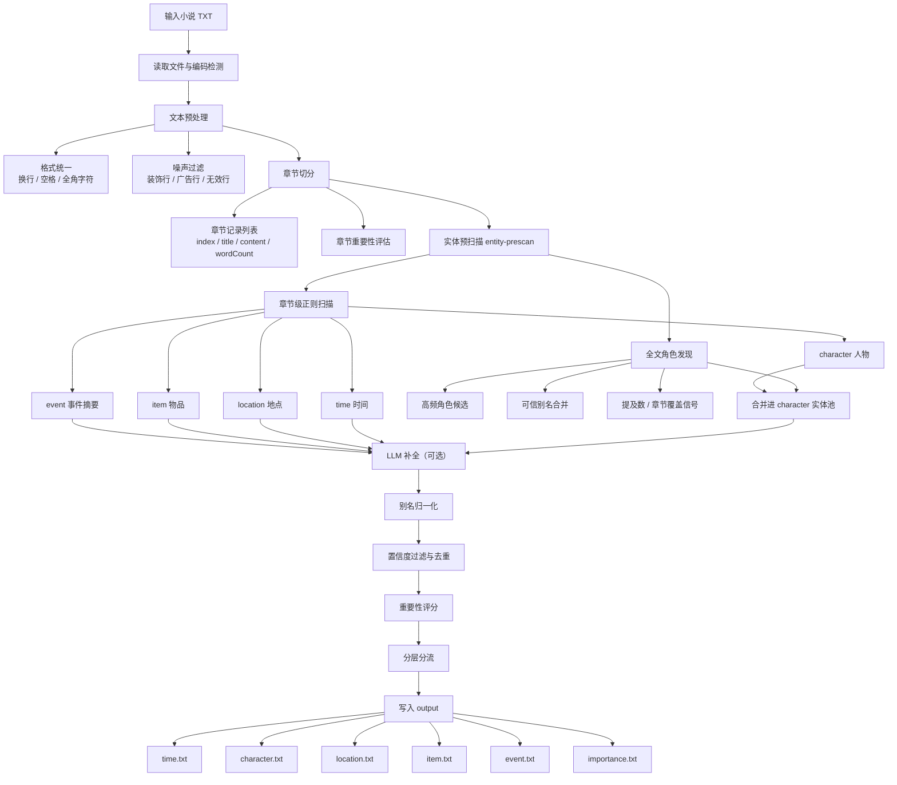
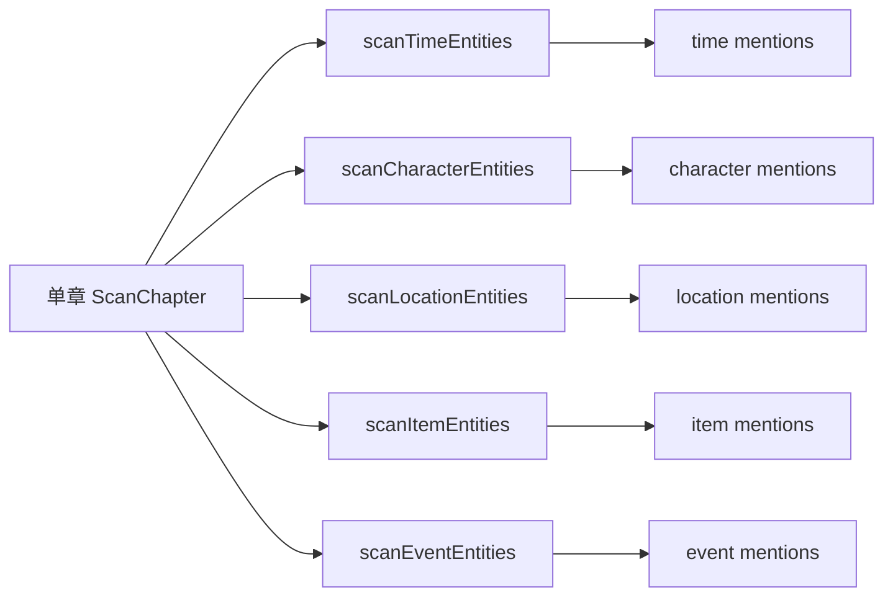
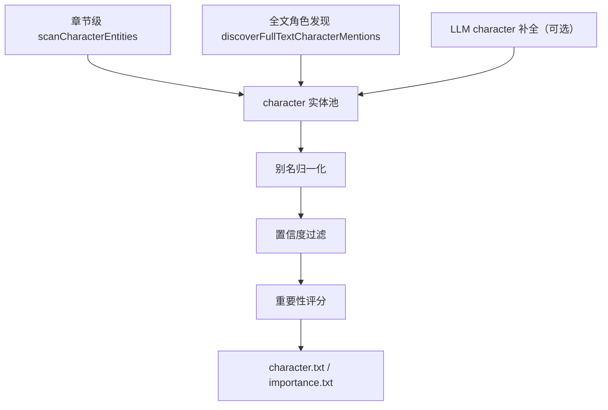
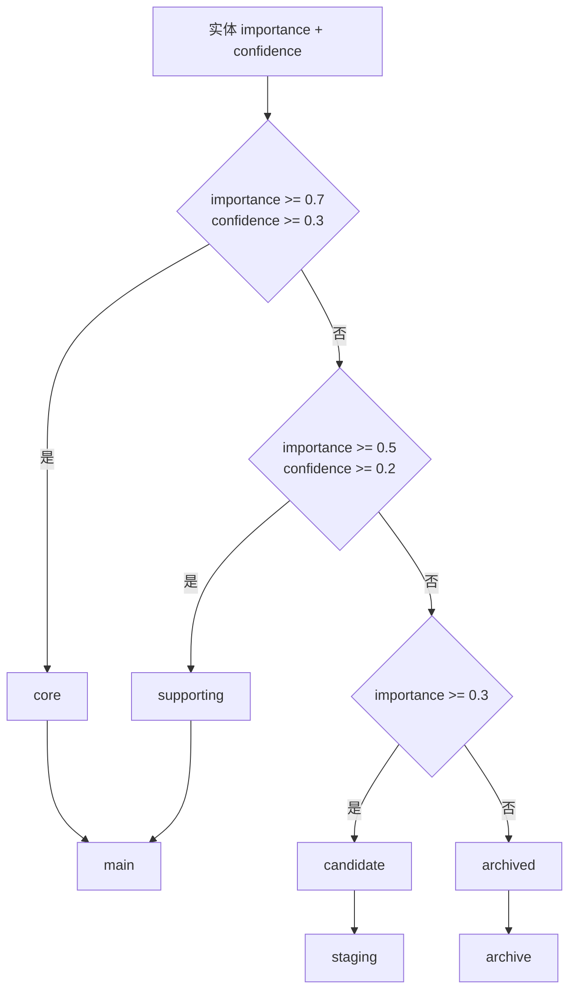

# 实体预扫描与重要性评分流程文档

本文档说明当前 `novel-agent` 中从小说 TXT 输入到 `output` 实体文件生成的完整流程。当前口径以 `thy` 分支最新工作区为准：角色发现已并入实体预扫描的 `character` 流程，事件输出为摘要式事件，不再照抄原文片段。

## 1. 总体流程



## 2. 输入与导入

入口脚本：

```text
test_full_pipeline.mjs
```

典型输入：

```text
D:/entity/test/大奉打更人—1.txt
```

导入阶段会完成：

```text
读取原始 TXT
→ 编码检测
→ 文本清洗
→ 章节切分
→ 章节结构分析
```

需要注意：流程里所谓“章节记录”不是额外生成文件，而是程序内部将每章整理为结构化数据，例如：

```ts
{
  index: 0,
  title: "牢狱之灾",
  content: "章节正文...",
  wordCount: 2515
}
```

## 3. 章节重要性评估

章节重要性用于判断章节本身在全书中的相对位置和主线程度，和实体重要性不是同一件事。

当前章节重要性公式：

```text
章节重要性 = 主线权重 × 0.35 + 主角密度 × 0.40 + 长度因子 × 0.25
```

章节重要性主要用于管道展示和章节层面的分析，不直接写入 `time.txt`、`character.txt` 等实体文件。

## 4. 实体预扫描

实体预扫描入口：

```text
entity-prescan/src/index.ts
```

当前支持 5 类实体：

```text
time      时间
character 人物
location  地点
item      物品
event     事件
```

对应输出文件：

```text
output/{bookId}/time.txt
output/{bookId}/character.txt
output/{bookId}/location.txt
output/{bookId}/item.txt
output/{bookId}/event.txt
output/{bookId}/importance.txt
```

## 5. 章节级实体扫描

章节级扫描会逐章运行各类 scanner：



扫描结果统一使用 `EntityMention`：

```ts
{
  text: "许七安",
  chapterIndex: 0,
  position: 123,
  source: "regex",
  confidence: 0.95,
  totalCount?: 1669,
  allChapters?: [0, 1, 2]
}
```

## 6. 角色发现并入 character 流程

之前 `test_full_pipeline.mjs` 里有一段独立的“角色发现（全文扫描）”逻辑。现在这部分已经并入 `entity-prescan`，成为 `character` 的增强来源。

相关模块：

```text
entity-prescan/src/role-discovery.ts
```

现在的 character 来源包括：



### 6.1 全文角色发现做什么

全文角色发现会从全书中补充章节级扫描容易漏掉的角色信号：

```text
高频角色候选
提及次数
出现章节覆盖
可信别名
```

### 6.2 当前可信别名映射

当前内置的保守别名合并：

```text
许宁宴 -> 许七安
许二叔 -> 许平志
许二郎 -> 许新年
陈府尹 -> 陈汉光
魏公   -> 魏渊
```

合并后：

```text
character.txt 输出 主名（别名：...）
importance.txt 中主名承接别名的提及数和章节覆盖
```

例如：

```text
许宁宴 的提及会回灌到 许七安
魏公 的提及会回灌到 魏渊
陈府尹 的提及会回灌到 陈汉光
```

## 7. 事件提取

事件提取模块：

```text
entity-prescan/src/scanners/event.ts
```

现在输出的是“事件摘要”，不是原文摘抄。

示例：

```text
圣上下令斩首许平志
陈府尹审问许七安
许七安解开税银案的真相
杨千幻失踪
梁有平失踪
许七安牺牲
```

事件模块会过滤掉弱动作和普通对话动作，例如：

```text
想到
点头
说道
离开
进入
普通动作描写
```

## 8. LLM 补全

实体预扫描保留了 LLM 补全入口：

```text
entity-prescan/src/llm-completion.ts
```

流程位置：

```text
regex 结果
→ LLM 补全（可选）
→ 合并
→ 别名归一化
→ 置信度过滤
```

当前端到端样例中配置为：

```js
useLLM: false
```

因此当前样例输出主要来自本地规则。

## 9. 置信度过滤与去重

模块：

```text
entity-prescan/src/confidence.ts
```

作用：

```text
按 text 分组
合并同名实体
保留最高置信度 mention
保留 totalCount
合并 allChapters
过滤低置信度实体
```

核心结果是把多次出现的实体压缩成一个实体记录，并保留总提及数和章节覆盖。

## 10. 重要性评分

模块：

```text
entity-prescan/src/importance.ts
```

根据交接文档，实体重要性采用“三支柱 + 呈现价值”的公式。

### 10.1 三支柱

```text
因果必要性 = 行为驱动度 + 不可替代性
信息唯一性 = 语义相似度反向
状态转折性 = 情感波动 + 关系变动 + 转折词密度
```

每个支柱映射为：

```text
0 / 1 / 2 分
```

三支柱加总得到：

```text
storyScore: 0-6
```

再查表 / 归一化得到：

```text
storyValue: 0-1
```

### 10.2 呈现价值

```text
productionValue = 写作完成度 + 改编可用性
```

当前会参考：

```text
描写细节
感官词
空间词
动作词
对话
角色/事件的提及覆盖
```

### 10.3 最终公式

```text
Importance = 0.7 × storyValue + 0.3 × productionValue
```

`importance.txt` 中对应字段：

```text
实体|重要性|置信度|分层|分流|因果|唯一|转折|storyScore|storyValue|呈现价值|提及|章节
```

## 11. 分层分流

模块：

```text
entity-prescan/src/scoring.ts
```

分层分流规则：



输出含义：

```text
core / supporting -> main
candidate         -> staging
archived          -> archive
```

## 12. 输出文件说明

输出目录：

```text
output/dafengdagengren-1/
```

文件说明：

```text
time.txt        最终时间实体
character.txt   最终人物实体，已包含全文角色发现与别名合并结果
location.txt    最终地点实体
item.txt        最终物品实体
event.txt       最终事件摘要
importance.txt  全量实体重要性审计报告
```

单类实体文件格式：

```text
章节号|实体文本|来源|置信度
```

示例：

```text
0|许七安（别名：许宁宴）|regex|0.95
18|魏渊（别名：魏公）|regex|0.95
0|圣上下令斩首许平志|regex|0.85
```

`importance.txt` 是全量审计报告，所以它的数量通常多于最终实体文件。最终实体文件只保留通过分层分流后的工作集。

## 13. 当前样例运行结果

最近一次端到端样例结果：

```text
时间: 正则148 + LLM0 → 去重26条
人物: 正则220 + LLM0 → 去重61条
地点: 正则664 + LLM0 → 去重37条
物品: 正则52 + LLM0 → 去重3条
事件: 正则23 + LLM0 → 去重17条
```

角色发现现在显示为：

```text
角色发现已并入实体预扫描 character 流程：
全文角色候选、别名合并、提及数信号会统一进入 character 实体池评分。
```

## 14. 验证命令

运行全量测试：

```bash
pnpm vitest run
```

当前验证结果：

```text
Test Files  11 passed
Tests       76 passed
```

运行端到端样例：

```bash
pnpm exec tsx test_full_pipeline.mjs "D:/entity/test/大奉打更人—1.txt"
```

## 15. 维护建议

后续如果要继续优化，建议按以下顺序：

```text
1. 扩充 role-discovery 的可信别名表
2. 将别名表外置成配置文件
3. 增强 item 物品召回
4. 继续收紧 location 误报
5. 为 event 增加更多剧情触发模板
6. 将 importance.txt 中 archived 候选单独拆成审计文件
```
