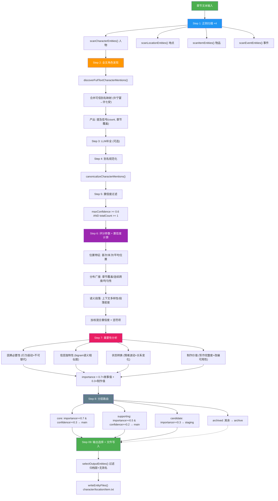
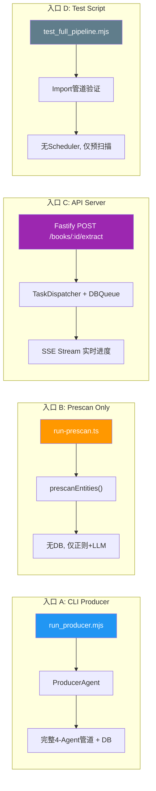
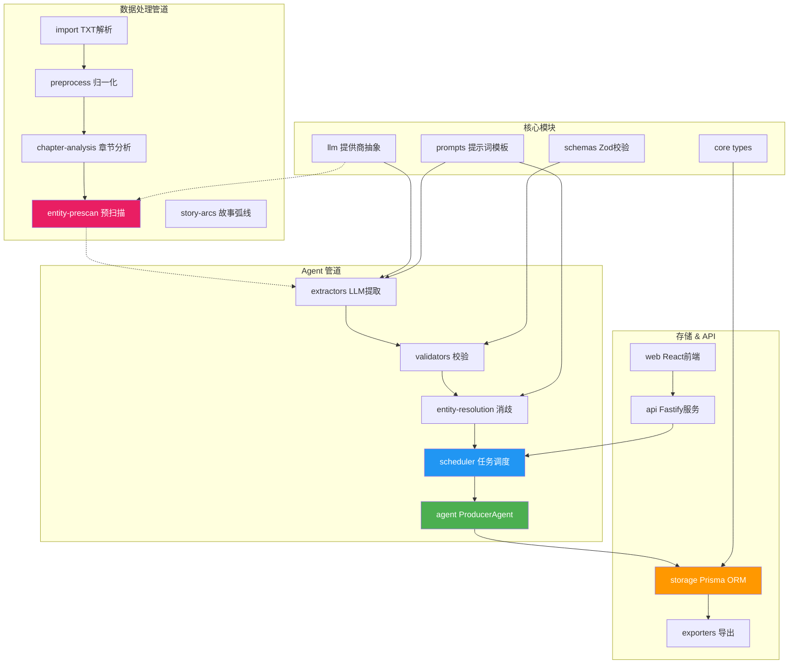

# Novel-Agent Pipeline Flowchart

## 端到端流程总览

```mermaid
flowchart TD
    A["📄 TXT 小说文件"] --> B["run_producer.mjs / API Server"]
    B --> C["ProducerAgent.run(bookId)"]
    C --> D["TaskDispatcher.startExtraction()"]
    D --> E["Stage 1: Extractor Agent"]

    E --> E1["BookRepository.findById() → 读取文件"]
    E1 --> E2["parseTxtEnhanced()"]
    E2 --> E2a["preprocess() 文本归一化+噪声过滤"]
    E2a --> E2b["splitChaptersStructured() 章节切分"]
    E2b --> E2c["analyzeChapters() 章节重要性分析"]
    E2c --> E2d["prescanEntities() 实体预扫描 ⬇️"]

    E2d --> E3["createExtractor() LLM批量提取 30章/批"]
    E3 --> E4["fuseCharactersWithPrescan() LLM主体+预扫描补充"]
    E4 --> E5["幻觉过滤: 0提及+0对话 → 丢弃"]
    E5 --> E6["llmEntitiesWithPrescan() 位置/物品增强"]
    E6 --> E7["extractStoryAssets() 故事资产提取"]

    E7 --> F["Dispatcher: 持久化到数据库"]
    F --> G["Stage 2: Validator Agent"]

    G --> G1["validateCharacters() 低置信/缺字段/别名冲突"]
    G1 --> G2["validateEntityBatch() 位置+物品 去重+阈值0.4"]
    G2 --> H["Stage 3: Entity Resolution Agent"]

    H --> H1["resolve() 同名合并/别名匹配/中文称谓归一化"]
    H1 --> H2["选择规范名 + 清洗别名"]
    H2 --> I["Dispatcher: 再次持久化到数据库"]

    I --> J["Stage 4: Reviewer Agent"]
    J --> J1["标记: 等待人工审核"]
    J1 --> K["writePipelineFinalSummary()"]
    K --> K1["output/run-summary.json"]
    K1 --> K2["entities/characters.json, items.json, locations.json, events.json"]
    K2 --> L["BookRepository.updateStatus('EXTRACTED')"]
    L --> M["eventBus.emit('completed')"]

    style A fill:#4CAF50,color:#fff
    style E fill:#2196F3,color:#fff
    style G fill:#FF9800,color:#fff
    style H fill:#9C27B0,color:#fff
    style J fill:#607D8B,color:#fff
    style M fill:#4CAF50,color:#fff
```

---

## Entity Pre-Scan 模块内部流程

---

## 入口对比

---

## 模块架构图

---

## 配置参数速查

| 参数 | 值 | 位置 |
|---|---|---|
| LLM 批次大小 | 30 章/批 | scheduler/dispatcher.ts |
| 最大并发批次 | 3 | scheduler/dispatcher.ts |
| 最大重试 | 3次, 指数退避 | scheduler/dispatcher.ts |
| 预扫描置信度阈值 | 0.6 | entity-prescan |
| 验证器实体阈值 | 0.4 | validators |
| 故事权重 / 制作权重 | 0.7 / 0.3 | entity-prescan/importance |
| core 层 | importance≥0.7, confidence≥0.3 | entity-prescan/scoring |
| supporting 层 | importance≥0.5, confidence≥0.2 | entity-prescan/scoring |
| candidate 层 | importance≥0.3 | entity-prescan/scoring |
| archived 层 | 其余 | entity-prescan/scoring |
