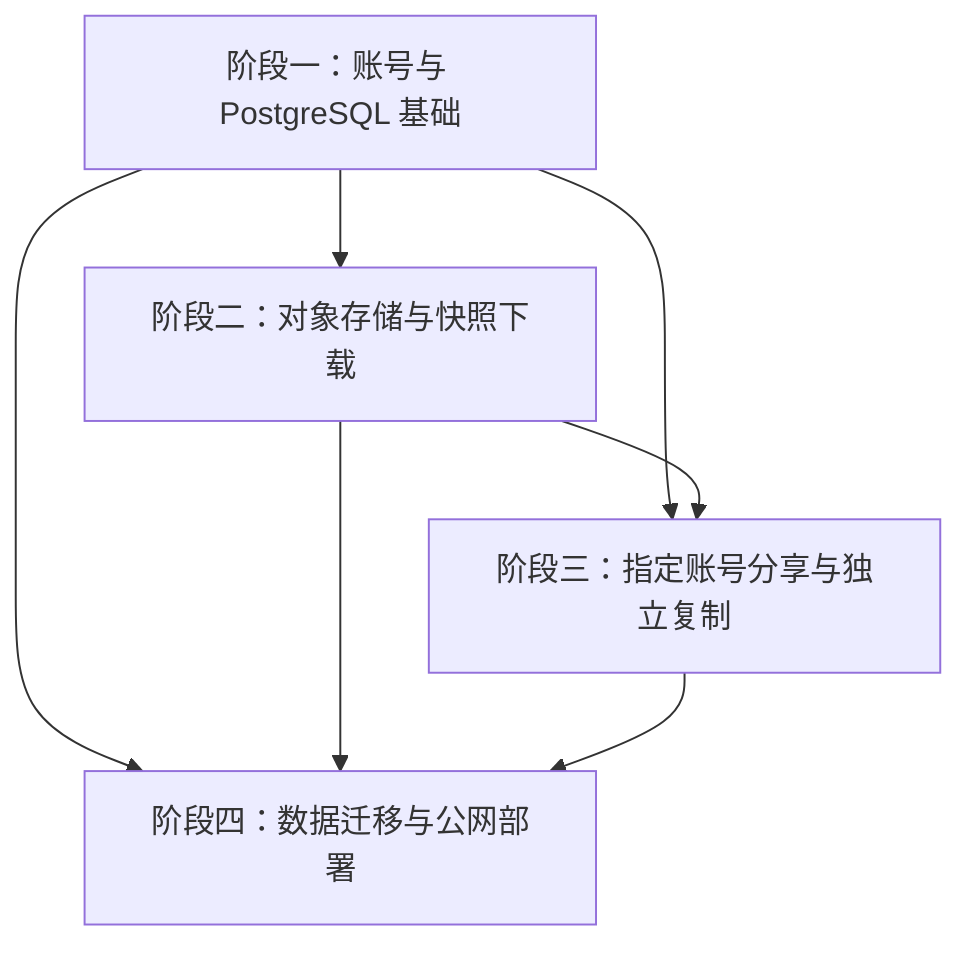

# 云端书库实施路线与留档约定

日期：2026-07-15
依据：[云端书库、账号资产与分享复制设计](../specs/2026-07-15-cloud-library-asset-sharing-design.md)

## 目标

把已批准的云端书库规格拆成四个可独立评审、验证和回滚的实施阶段。每个阶段都有独立计划、提交、测试证据和迁移说明，后续调整可以追溯到具体决策与代码变更。

## 阶段与依赖

### 阶段一：账号与 PostgreSQL 基础

计划文件：`docs/superpowers/plans/2026-07-15-cloud-library-phase1-accounts-postgresql.md`

交付内容：

- 移除启动期默认账号归并和前端固定账号静默登录。
- 建立 PostgreSQL baseline migration 和隔离测试数据库。
- 邮箱规范化与不可猜测账号分享码。
- 短期访问令牌、刷新 Cookie、轮换重放防护和 CSRF/Origin 校验。
- 前端仅内存访问令牌，移除 URL 查询串令牌。
- PostgreSQL `BackgroundJob` 租约任务仓储。
- 所有权条件下推和中文错误回归。

完成门：账号在重启后不变；跨账号访问被拒绝；刷新会话与后台任务并发测试通过；全量构建通过。

### 阶段二：对象存储与快照下载

计划状态：尚未生成；阶段一接口稳定并完成证据门后，生成 `docs/superpowers/plans/2026-07-15-cloud-library-phase2-snapshots-downloads.md`。

交付内容：

- S3 兼容对象存储抽象和 MinIO 集成测试环境。
- 原书、图片、提取/故事/导演产物去本机路径化。
- 不可变 `AssetObject/AssetSnapshot/SnapshotObject`。
- 确定性 manifest、脱敏 golden 样本、唯一异步 ZIP 打包。
- 短时签名下载、ETag/Range 续传和书库下载状态。

完成门：同一快照重复打包内容一致；跨账号下载被拒绝；签名过期后能对同一 ETag 续传；完整数据包校验通过。

### 阶段三：指定账号分享与独立复制

计划状态：尚未生成；阶段二的快照不可变约束稳定后，生成 `docs/superpowers/plans/2026-07-15-cloud-library-phase3-sharing-copy.md`。

交付内容：

- 邮箱加分享码确认。
- `active/copying/copied/revoked` 原子状态机。
- 接收方“分享给我”页面。
- 新建目标 Book 与目标 Snapshot，只复用不可变对象。
- 撤销竞态、幂等复制、审计和延迟对象清理。

完成门：撤销与领取任务只能一方成功；复制产生独立版本线；删除原书不影响副本；对象最后一个引用删除后才回收。

### 阶段四：数据迁移与公网部署

计划状态：尚未生成；阶段一至三的数据库与对象存储契约稳定后，生成 `docs/superpowers/plans/2026-07-15-cloud-library-phase4-migration-deployment.md`。

交付内容：

- SQLite 和文件资产 dry-run 预检。
- 账号污染、无效哈希、重复邮箱、跨用户引用和 UUID 冲突阻塞报告。
- 幂等上传、检查点、校验、停写窗口、切流和回滚。
- 公网 HTTPS 容器化部署、密钥配置、备份与恢复演练。
- 两台真实设备端到端验收。

完成门：源端和目标端计数、字节数与 SHA-256 核对通过；回滚演练通过；真实两设备登录、下载和分享复制通过。

## 留档与溯源规则

### 纳入 Git 的记录

- 设计：`docs/superpowers/specs/`
- 实施计划：`docs/superpowers/plans/`
- 重要偏差决策：`docs/superpowers/decisions/`
- 脱敏测试证据摘要：`docs/superpowers/evidence/<phase>/`
- PostgreSQL migrations、接口 schema、测试夹具和 golden manifest。

每个阶段使用多个小提交。提交信息必须包含 `Constraint`、`Confidence`、`Scope-risk`；存在明确否决方案时增加 `Rejected`，未运行某项验证时增加 `Not-tested`。计划任务的提交哈希写回阶段证据摘要。

### 不纳入 Git 的记录

- 含真实邮箱、原文、图片、对象签名地址或密钥的迁移原始报告。
- 数据库备份、对象存储转储和完整 ZIP。
- 正式环境 `.env`、Cookie、JWT、API Key 和对象存储凭据。

这些运行时档案保存在服务器受限目录 `var/audit/`，按日期和迁移运行 ID 分层。Git 中只提交脱敏摘要、计数、哈希和结论。

### 变更控制

- 实现与已批准规格不一致时，先新增 decision 文档，再改计划和代码。
- 每个任务先写失败测试，再做最小实现，再运行定向测试和相关回归。
- 每个阶段由独立 reviewer 检查规格符合性，再由 verifier 运行完成证据。
- 迁移和部署必须先 dry-run；未处理阻塞项不得切流。

## 已知前置事实

- 当前仓库的 SQLite migration 已落后于现行 schema，旧 `migrate-data.ts` 还引用不存在的字段，不能作为正式迁移工具。
- 当前 `Task` 是提取管线细粒度任务，不能替代带唯一键、租约和心跳的 `BackgroundJob`。
- 当前历史 `output` 多数无法与现有 Book ID 可靠关联，阶段四不得猜测归属。
- 当前没有可关联数据库且同时包含原文、图片、故事和导演产物的完整样本；阶段二必须建立脱敏 golden 样本。
