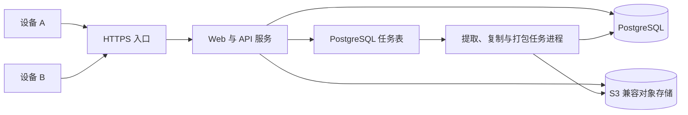

# 云端书库、账号资产与分享复制设计

日期：2026-07-15
状态：已完成方案确认，待实施计划

## 1. 背景

当前系统以单机模式运行：账号和结构化数据保存在本地 SQLite，原始书籍、图片、提取结果、故事与导演产物分散在本机目录。前端在没有登录令牌时还会静默登录固定默认账号，后端启动时会调用默认账号归并逻辑，删除其他账号或改写账号邮箱和密码。这与多账号持久化、书籍归属和跨设备访问直接冲突。

目标形态是公网常在线服务。两台或更多设备连接同一个服务，用户登录后看到自己的云端书库，可以下载当前完整成果；书籍默认私有，所有者可以将指定书籍分享给另一个已注册账号，接收方可以把分享内容复制成自己名下的独立书籍。

## 2. 已确认决策

- 使用公网云服务器作为唯一权威数据源。
- 使用 PostgreSQL 保存账号、归属、结构化数据和操作记录。
- 使用 S3 兼容对象存储保存原始书籍、图片、提取产物和完整数据包。
- 下载范围为“当前完整成果”：原始书籍、实体、审核状态、最新提取结果、故事、分镜、提示词和图片。
- 账号资产默认私有。
- 第一版只允许向已注册账号分享，不提供匿名链接。邮箱只用于查找候选账号；由于第一版不验证邮箱，最终确认必须同时核对接收方提供的不可猜测账号分享码。
- 接收方不能修改原书；可以将分享复制到自己的书库，复制后双方数据独立。
- 第一版不验证邮箱，不提供邮件找回密码；忘记密码由管理员重置。
- 当前 SQLite 和本机文件通过一次性、可重复执行的迁移工具导入云端。

## 3. 目标与非目标

### 3.1 目标

1. 注册账号能够稳定入库，服务重启不会删除、合并或改写账号。
2. 同一账号在不同设备登录后看到相同的私有书库。
3. 每本书及其所有衍生资产都能追溯到唯一所有者。
4. 已完成书籍可以生成版本化、可校验、可断点续传的完整 ZIP 数据包。
5. 所有者可以将书分享给另一个已注册账号，接收方可以复制为独立书籍。
6. 当前本机账号、书籍和成果能够安全迁移，且迁移失败不破坏原数据。
7. 所有用户可见文案、错误和项目新增日志使用中文。

### 3.2 非目标

- 第一版不做匿名分享链接、团队空间或多人实时协作编辑。
- 第一版不做邮箱验证码、自助找回密码或第三方登录；未验证邮箱不能单独作为私有资产接收凭证。
- 第一版不做多设备离线双向同步；客户端不持有权威数据库。
- 第一版不迁移运行中的临时任务、服务内部日志或服务器密钥。
- 第一版不保存全部历史提取版本，只发布最新稳定成果快照。

## 4. 总体架构



- **Web 与 API 服务**：处理注册、登录、书库查询、授权、分享、复制请求和下载授权。
- **后台任务进程**：通过 PostgreSQL 任务表领取任务，处理书籍提取、资产快照、ZIP 打包和分享复制；长任务不占用普通 HTTP 请求。
- **PostgreSQL**：保存权威元数据和结构化成果。
- **对象存储**：保存不可变二进制或文件型资产。
- **HTTPS 入口**：统一域名、TLS、请求大小限制和安全响应头。

客户端只缓存登录状态和查询结果，不保存权威业务数据。正式环境不再依赖 `localhost`、`D:\entity` 或进程当前工作目录。

## 5. 数据边界与核心模型

### 5.1 PostgreSQL 保存

- 用户、规范化邮箱、密码哈希、账号状态和创建时间。
- 可撤销、可轮换的刷新会话。
- 书籍元数据、所有者、处理状态和当前快照版本。
- 人物、场景、道具、审核记录、噪声恢复记录和实体图片元数据。
- 分享记录、复制来源和操作审计。
- 资产快照、文件清单、对象键、字节数和 SHA-256 校验值。
- 后台任务状态、失败原因和可重试次数。
- 对象引用计数或等价的对象引用关系。

### 5.2 对象存储保存

- 原始 TXT。
- 实体图片。
- 最新稳定提取运行的文件型产物。
- 故事切分、资产、剧集、分镜和导演产物。
- 已生成的完整 ZIP 数据包。

对象键使用稳定逻辑路径，例如 `books/{bookId}/source/{version}.txt`，数据库不保存 Windows 绝对路径。对象默认私有，不能通过永久公开地址访问。

### 5.3 新增核心关系

- `Book.ownerId -> User.id`：书籍唯一所有者。
- `Book.currentSnapshotId -> AssetSnapshot.id`：当前可下载的稳定快照。
- `User.shareCodeHash`：用户分享码的摘要。分享码由高强度随机数生成，只向账号本人展示和轮换，不能由邮箱或用户 ID 推导。
- `BookShare(id, bookId, snapshotId, senderId, recipientId, status, createdAt, claimedAt, copiedAt, revokedAt)`：指定账号分享；状态限定为 `active/copying/copied/revoked`，同一本书与同一接收账号最多一个非撤销记录。
- `Book.sourceBookId/sourceShareId`：复制来源，仅用于审计；原书删除时 `sourceBookId` 置空，不能据此授予原书访问权限。
- `AssetSnapshot(id, bookId, version, status, manifestObjectId, createdAt)`：每本书的版本号唯一，状态限定为 `building/ready/failed`；只有 `ready` 快照可以下载或分享。
- `AssetObject(id, sha256, bytes, mime, objectKey)`：`sha256 + bytes` 唯一，对象键私有且不可变。
- `SnapshotObject(snapshotId, objectId, logicalPath)`：快照与对象的引用关系，`snapshotId + logicalPath` 唯一；引用数量由关系表事务计算，不依赖可漂移的裸计数器。
- `RefreshSession(id, userId, familyId, tokenHash, expiresAt, rotatedAt, revokedAt)`：保存刷新令牌摘要和轮换链，同一明文令牌只允许成功使用一次。
- `BackgroundJob(id, kind, uniqueKey, status, payload, attempts, leaseOwner, leaseExpiresAt, nextRunAt)`：任务唯一键防止重复创建，状态限定为 `pending/running/succeeded/failed`。

## 6. 账号、登录与会话

1. 删除后端启动时的默认账号创建、清理和归并调用；删除前端固定账号静默登录。
2. 注册和登录前，将邮箱去除首尾空格并统一转成小写；数据库对规范化邮箱建立唯一约束。
3. 密码继续使用随机盐和安全哈希，只保存哈希，不记录明文密码。
4. 注册成功后创建真实用户、随机账号分享码，并签发短期访问令牌和可轮换刷新令牌。
5. 访问令牌只保存在前端内存中，不写入 `localStorage`；刷新令牌使用 `HttpOnly + Secure + SameSite=Lax` Cookie，Path 仅覆盖认证刷新接口。修改类请求同时校验受信任 `Origin`，刷新和退出接口要求自定义 CSRF 请求头。
6. 刷新成功后旧令牌立即失效；检测到旧令牌重放时撤销同一 `familyId` 的全部会话。退出登录撤销当前会话，管理员重置密码撤销该账号全部会话。
7. 账号不存在和密码错误统一返回“邮箱或密码错误”，避免枚举注册邮箱。
8. 第一版只允许管理员执行密码重置；重置后撤销该账号全部刷新会话。
9. 服务重启、部署和迁移不得改变任何用户邮箱、密码或所有权。

## 7. 所有权与授权

- 默认规则是 `当前用户 == Book.ownerId` 才能查看、修改、删除、重新提取或下载书籍。
- 分享记录只允许接收方查看安全摘要和执行“复制到我的书库”；不允许直接读取原书正文、图片或内部对象键。
- 所有对象下载必须先通过业务授权，再返回短时有效的签名地址。
- 对不存在和无权限的书籍统一返回中文 `404`，避免泄露其他账号资产是否存在。
- 后台任务收到的 `userId/bookId/snapshotId/shareId` 必须重新校验，不能只信任前端请求时的检查结果。分享复制还必须在领取任务的同一事务中校验 `recipientId`、快照和分享状态。
- 数据库查询默认包含所有者条件，不能先按 ID 查出后再依赖调用方自行判断。

## 8. 分享与复制流程

1. 接收方在账号页把邮箱和随机账号分享码通过可信的线下渠道提供给所有者；分享码可由接收方主动轮换。
2. 所有者输入接收方邮箱和分享码。服务端规范化邮箱，并校验账号状态及分享码摘要；邮箱与分享码必须指向同一账号，且禁止分享给自己。
3. 分享接口对失败统一返回“无法分享给该账号，请核对邮箱和分享码”，并按发送者限流和记录审计，避免批量枚举注册邮箱。
4. 创建分享时锁定原书当时的 `ready` 快照；同一本书与同一接收方只保留一个非撤销分享记录，重复操作返回当前记录。
5. 接收方在“分享给我”中看到书名、所有者显示名、处理状态、文件大小和分享时间。
6. 接收方点击“复制到我的书库”后，以 `shareId + recipientId` 生成唯一任务键。
7. Worker 在同一数据库事务中用条件更新把 `active` 原子变为 `copying`；条件必须包含当前接收方和锁定快照。撤销只能把 `active` 变为 `revoked`，因此撤销和领取任务由先成功的事务决定：撤销先成功则复制不得开始，领取先成功则界面显示“复制中”且不能撤销。
8. 复制事务创建新的目标 `Book` 和目标 `AssetSnapshot` 行，复制结构化成果，并为目标快照新建 `SnapshotObject` 引用；目标书不能直接指向原书快照。底层不可变 `AssetObject` 可以复用。
9. 全部数据库和对象引用提交成功后，分享状态变为 `copied`。失败则删除未提交目标记录并将分享恢复为 `active`；不可恢复错误标记任务失败并显示中文原因。
10. 复制成功后新书归接收方所有，拥有新书 ID、目标快照和独立版本线。任何后续修改会产生自己的对象和快照，不影响原书。
11. 复制完成后的独立副本不随原分享撤销或原书删除而消失。重复请求通过唯一任务键返回同一结果，不创建多份副本。

删除对象时不能直接删除仍被其他书籍或快照引用的底层文件。对象引用归零后进入延迟清理队列，由后台任务最终删除。

## 9. 完整成果快照与数据包

只有处于“处理完成”且没有正在发布写入的书籍能够发布快照。快照一经发布不可修改；书籍修改并重新发布后创建新快照。

ZIP 固定结构如下：

```text
书名-资产包.zip
├─ manifest.json
├─ source/原始书籍.txt
├─ entities/characters.json
├─ entities/locations.json
├─ entities/items.json
├─ reviews/current.json
├─ reviews/history.json
├─ chapters/outline.json
├─ chapters/cleaned/
├─ noise/overrides.json
├─ extraction/latest/run-summary.json
├─ extraction/latest/prescan/
├─ extraction/latest/artifacts/
├─ stories/story-segments.json
├─ stories/assets/
├─ stories/episodes/
├─ stories/director/
├─ images/index.json
└─ images/files/
```

资产合同如下：

- `source`、三类实体 JSON、当前审核状态、审核历史、噪声恢复记录、运行摘要和图片索引为必选；没有数据时使用带 `schemaVersion` 的空数组或空对象，不能省略。
- 清洗章节在提取完成时必选；每章使用 UTF-8 文本，`outline.json` 给出稳定章节序号、标题和相对路径。
- `prescan`、富描述、视觉描述、提示词和叙事事件按最新稳定运行逐项收录。某类产物没有生成时，`manifest.json` 必须记录 `not-generated` 或 `empty` 及中文原因，不能静默缺失。
- 故事切分、故事资产、剧集、分镜和导演产物属于条件必选：用户执行过对应流程就必须收录；未执行时在清单中标记 `not-generated`。
- `images/index.json` 包含实体类型、实体名、主图标记、MIME、相对路径和校验值；图片二进制必须与索引同时存在。
- 所有 JSON 顶层包含各自的 `schemaVersion`，采用 UTF-8、稳定字段结构和确定性排序；同一快照重复打包应产生相同文件清单和内容校验值。

`manifest.json` 至少包含：数据包 `schemaVersion`、书籍 ID、快照 ID、生成时间、来源类型、各资产类别状态、文件清单、相对路径、字节数、MIME 类型、对象版本或 ETag 和 SHA-256 校验值。账号密码、令牌、API Key、运行中的任务和内部日志不得进入数据包。实施前以当前仓库中一本文字、图片、故事和导演产物齐全的真实完成书生成 golden manifest，作为数据合同回归样本。

下载流程：

1. 用户请求下载当前快照。
2. API 校验书籍所有权和快照状态。
3. 已有 ZIP 时直接返回短时签名地址；没有时创建唯一打包任务。
4. 前端轮询任务状态并显示中文进度；完成后显示下载按钮。
5. 对象存储提供范围请求和断点续传。同一快照只生成一个 ZIP；响应固定返回对象版本或 ETag。
6. 签名地址短时有效，过期后针对同一对象版本重新授权，不重新生成 ZIP；客户端使用 `Range` 和原 ETag 继续下载，若版本不一致则明确提示重新下载。

## 10. 部署与配置

- 公网服务器使用容器化部署，拆分 HTTPS 入口、Web/API、后台任务和 PostgreSQL。第一版直接使用 PostgreSQL 任务表，不引入额外队列服务。
- 对象存储通过统一接口接入 AWS S3、Cloudflare R2、阿里云 OSS 或 MinIO，业务代码不绑定单一供应商。
- 域名、数据库地址、对象存储凭据、JWT 密钥和跨域白名单全部来自环境变量或密钥管理，不提交到 Git。
- 正式环境强制 HTTPS；刷新 Cookie、内存访问令牌、Origin/CSRF 校验按第 6 节执行；CORS 只允许正式站点域名并禁止通配符凭据。
- PostgreSQL 任务表采用至少一次投递。Worker 使用 `FOR UPDATE SKIP LOCKED` 原子领取、租约和心跳；租约过期任务可被其他 Worker 恢复。每类任务定义唯一键、并发上限、最大 3 次指数退避重试和不可重试错误集合。
- 数据库定期备份并验证恢复；对象存储启用版本保护或生命周期策略。
- 开发和测试使用独立数据库与测试存储桶，启动时拒绝明显指向正式资源的测试配置。

## 11. 现有数据迁移

迁移工具必须默认只读预检，并显式指定执行模式后才写云端：

1. 先建立一套可在空 PostgreSQL 中完整重建的正式 baseline migration，明确时间类型、JSON 字符串转换、唯一约束、外键和删除规则；正式环境禁止使用 `db push` 代替迁移。
2. 备份当前 SQLite、原书、图片、`output` 和相关故事中间产物，并验证备份可读取。
3. 扫描用户、书籍、结构化数据和文件，输出缺失文件、重复邮箱、孤立记录、跨用户审核引用和无法关联的历史目录。
4. 以下情况一律作为 dry-run 阻塞项，不自动猜测：空或无效密码哈希、疑似被默认账号逻辑改写的邮箱或密码、邮箱规范化冲突、`CharacterReview.userId` 等跨用户引用不一致、源端同 UUID 重复，以及目标端同 UUID 但内容或校验值不同。
5. 管理员必须为每个账号阻塞项提供明确的保留、合并或强制重置映射；密码被重置的账号首次登录前由管理员安全交付临时密码。
6. 保留用户和书籍 UUID，维持现有所有权；不得执行默认账号归并。目标端同 UUID 且同校验值时幂等跳过，同 UUID 不同内容时立即中止。
7. 将 SQLite 的毫秒时间、可空字段和 JSON 字符串按 baseline 规则转换并验证，再上传原书、图片和最新完整成果，写入对象键与校验信息。
8. 为每本有效的已完成书籍创建首个云端快照。
9. 按用户数、书籍数、实体数、审核数、图片数、文件字节数和 SHA-256 做源端与目标端核对。
10. 迁移过程记录检查点，重复执行时跳过已校验对象，失败后可续传。
11. 切换时进入明确停写窗口：停止本机写入、执行最终增量迁移、核对、切换客户端 API 地址并完成冒烟测试。失败则在窗口内切回只读保留的原服务和原数据库；原本机数据不自动删除。

迁移写入失败时回滚当前数据库批次；已上传但未被提交引用的对象由孤儿清理任务延后回收。迁移报告和错误信息使用中文，敏感配置只显示是否已配置，不输出实际值。

## 12. 错误处理与可观测性

- 所有用户可见错误返回稳定中文消息和机器可识别错误码。
- 注册冲突、认证失败、无权限、资源不存在、快照未就绪、对象存储不可用和任务失败分别映射到明确状态码。
- 长任务保存阶段、进度、重试次数和最终中文失败原因。
- 对 PostgreSQL 短暂故障、对象存储超时和可重试网络错误采用有限指数退避；业务冲突和权限错误不重试。
- API、后台任务和下载授权使用关联 ID 串联日志，但不记录密码、令牌、原文内容或对象存储签名地址。
- 删除、分享、撤销、复制、管理员重置密码和迁移执行写入审计记录。

## 13. 测试策略

### 13.1 单元测试

- 邮箱规范化和唯一性。
- 账号分享码生成、摘要校验和轮换。
- 密码验证、刷新令牌轮换、重放检测与整条 family 撤销。
- 所有权和分享权限判定。
- 分享状态机、撤销与领取任务的原子条件。
- 快照清单、各 JSON `schemaVersion`、ZIP 路径安全、确定性排序和 SHA-256 计算。
- 对象引用计数及延迟删除条件。
- 迁移映射、冲突识别和幂等检查点。

### 13.2 集成测试

- 注册、重复注册、登录、错误密码、退出、CSRF/Origin 拦截和刷新令牌重放。
- API 重启后账号、密码和书籍归属保持不变。
- A 用户不能读取、修改或下载 B 用户书籍。
- 错误邮箱或分享码统一失败且被限流；正确邮箱加分享码只能定位唯一接收账号。
- A 分享给 B，B 可见摘要并只产生一个目标 `Book` 和目标 `AssetSnapshot`；C 无法访问。
- 撤销与 Worker 领取并发时只有一个状态转换成功；已撤销分享绝不能复制。
- 复制后原书删除、复制后双方修改互不影响，共享对象只有在最后一个引用删除后才回收。
- 打包任务幂等、golden manifest 一致、签名地址过期、基于同一 ETag 的范围续传和校验值一致。
- Worker 处理过程中崩溃后，租约到期可恢复，唯一任务不会产生重复业务结果；超过重试上限后稳定失败。
- PostgreSQL 或对象存储短暂失败后的恢复与中文错误。
- PostgreSQL baseline 可在空库完整建库并通过约束检查。
- 迁移 dry-run 阻塞项、失败回滚、停写切流、断点续传、同 UUID 冲突和重复执行。

### 13.3 端到端验收

1. 设备 A 注册并上传一本书，完成处理和快照发布。
2. 设备 B 使用同一账号登录，能看到同一本书并下载校验通过的完整 ZIP。
3. 账号 B 把邮箱和分享码提供给账号 A；A 分享后，B 复制并在“我的书库”看到独立副本。
4. A 修改或删除原书不影响 B 的副本。
5. 服务重启和重新部署后两个账号均可正常登录，资产归属不变。
6. 未登录用户和其他账号无法通过猜测 API、书籍 ID 或对象地址获得数据。

## 14. 分阶段实施

### 阶段一：账号与云端数据基础

- 移除默认账号机制。
- PostgreSQL baseline migration、正式迁移流程和任务表。
- 邮箱规范化、账号分享码、内存访问令牌、刷新 Cookie 和 CSRF 防护。
- 所有权回归测试和中文错误。

### 阶段二：对象存储与快照下载

- 对象存储抽象和文件路径改造。
- 稳定快照、清单、异步打包和签名下载。
- 书库下载状态界面。

### 阶段三：分享复制

- 分享记录、“分享给我”界面和撤销。
- 原子分享状态机、独立快照复制任务、对象复用和审计。
- 分享与复制权限测试。

### 阶段四：迁移与部署

- 现有数据预检和迁移工具。
- 停写切流、公网容器化部署、备份和恢复演练。
- 使用真实两台设备完成端到端验收。

## 15. 完成标准

- 不存在任何启动时自动创建、删除、合并或改写真实账号的逻辑。
- 账号、书籍和分享数据在服务重启后保持一致。
- 所有书籍与衍生资产都有可验证的所有者和授权路径。
- 两台设备使用同一账号能访问相同书库并下载完整成果。
- 指定账号分享与独立复制符合本设计，且不存在跨账号越权。
- 迁移报告无未处理阻塞项，源端与云端数据核对通过。
- 自动测试、构建、迁移演练和真实端到端验收全部通过。
