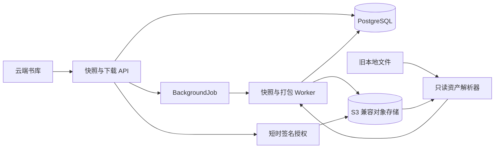

# 云端书库阶段二：对象存储、成果快照与完整下载设计交接稿

日期：2026-07-16

状态：讨论稿，供新任务继续确认；不是最终批准规格

上位设计：`docs/superpowers/specs/2026-07-15-cloud-library-asset-sharing-design.md`

实施路线：`docs/superpowers/plans/2026-07-15-cloud-library-roadmap.md`

## 1. 当前基线

阶段一已经完成账号持久化、PostgreSQL baseline、刷新会话、前端账号隔离、后台任务租约、所有权下推和验证留档。本地 `main` 已包含阶段一，PR `#11` 标题为“资产与账号绑定P1”，CI 已通过且 GitHub 显示可干净合并。

阶段二只处理对象存储、不可变快照、确定性数据包和下载状态，不实现账号间分享复制，也不执行旧 SQLite 和本地文件的正式迁移。

## 2. 已确认决策

### 2.1 兼容过渡

- 新上传原书和阶段二改造后的新文件型产物写入 S3 兼容对象存储。
- 旧 `Book.filePath` 和历史本地文件在阶段四迁移前保持只读回退能力。
- 不做本地文件与对象存储双写，避免两个副本状态漂移。
- 新代码不能继续把 Windows 绝对路径当作云端资产身份；对象身份由 `AssetObject` 和稳定对象键表达。
- 删除旧书时只删除或解除其权威对象引用；本地遗留文件的正式清理由阶段四迁移计划决定。

### 2.2 按需生成快照

- 用户点击“准备完整下载”时，系统冻结当时的最新稳定成果并创建不可变快照。
- 若当前成果版本与现有 `ready` 快照一致，直接复用已有快照和 ZIP。
- 若成果已变化，书库显示“需要更新数据包”；用户再次点击后创建新快照。
- 同一成果版本只能产生一个有效快照任务和一个 ZIP 对象。
- 快照创建期间不阻塞普通查询；前端显示中文状态和进度。

## 3. 尚待新任务确认的首要决策

对象存储部署方式尚未由用户最终选择。当前推荐方案是：

- 本地开发和集成测试使用 MinIO。
- 正式环境通过通用 S3 配置接入任意 S3 兼容服务。
- 业务代码只依赖内部 `ObjectStore` 接口，不直接依赖某个云厂商 SDK 的扩展功能。

新任务应先让用户确认该推荐方案；若用户选择自建 MinIO 正式环境或绑定单一厂商，需要同步调整部署、备份和配置边界。

## 4. 目标与非目标

### 4.1 目标

1. 新原书、实体图片、提取文件产物、故事产物和导演产物不再依赖服务器本机绝对路径。
2. 处理稳定的书籍可以按需发布不可变、版本化、可校验的完整成果快照。
3. 同一快照重复生成 manifest 和 ZIP 时，文件顺序、内容校验值和 ZIP 字节保持一致。
4. 所有者可以从云端书库查看数据包状态并获取短时签名下载地址。
5. 签名过期后可以针对同一对象版本和 ETag 重新授权，并使用 `Range` 续传。
6. 未登录用户和其他账号不能读取 manifest、查询打包任务或下载对象。
7. 旧本地文件在阶段四迁移前仍能被现有流程只读使用。
8. 所有新增用户文案、错误和运行日志使用中文。

### 4.2 非目标

- 不实现匿名下载链接。
- 不实现账号间分享、领取、复制和撤销状态机；这些属于阶段三。
- 不迁移全部历史本地文件；这些属于阶段四。
- 不实现离线双向同步或客户端权威数据库。
- 不保存每次临时提取运行，只冻结用户请求时的最新稳定成果。
- 不提供任意对象浏览器；阶段二的用户入口是书库中的完整数据包状态和下载动作。

## 5. 建议架构



### 5.1 对象存储边界

新增独立对象存储包或模块，公开最小接口：

```ts
interface ObjectStore {
  put(input: PutObjectInput): Promise<StoredObject>;
  head(objectKey: string): Promise<ObjectMetadata | null>;
  get(objectKey: string, range?: ByteRange): Promise<ObjectBody>;
  delete(objectKey: string): Promise<void>;
  createDownloadUrl(input: SignedDownloadInput): Promise<SignedDownload>;
}
```

接口只暴露对象键、字节数、MIME、ETag/版本、SHA-256、范围读取和短时签名。业务服务不得持有 bucket 内部永久公开地址，也不得把签名地址写入数据库。

### 5.2 资产读取兼容层

新增只读 `AssetSourceResolver`：

- 对已有 `AssetObject` 的资产，从对象存储读取。
- 对尚未迁移且带合法 `filePath` 的旧资产，从本地文件读取。
- 对新资产禁止回退到任意本地绝对路径。
- 本地回退仅允许已由所有权校验定位到的数据库记录，不能接受用户提交的路径。

上传、图片生成、故事和导演写入逐步改为“先生成临时内容，再写对象存储并事务登记元数据”。阶段二计划应按产物类型拆任务，避免一次重写所有生产流程。

## 6. 数据模型

建议新增：

- `AssetObject(id, sha256, bytes, mime, objectKey, etag, versionId, createdAt)`
- `AssetSnapshot(id, bookId, version, contentRevision, status, manifestObjectId, archiveObjectId, failureReason, createdAt, readyAt)`
- `SnapshotObject(snapshotId, objectId, logicalPath, category, state, reason)`
- `Book.currentSnapshotId`

约束：

- `AssetObject(sha256, bytes)` 唯一，对象不可覆盖。
- `AssetSnapshot(bookId, version)` 唯一。
- `AssetSnapshot(bookId, contentRevision)` 对未失败结果唯一，防止同一成果重复发布。
- `SnapshotObject(snapshotId, logicalPath)` 唯一。
- `manifestObjectId` 和 `archiveObjectId` 只能在快照进入 `ready` 时一次性写入。
- `ready` 快照不可再修改其对象关系。
- 对象是否可删除由实际引用关系事务计算，不使用可漂移的裸引用计数器。

`contentRevision` 必须由权威结构化数据更新时间、稳定运行 ID 和文件型资产对象 ID 确定性计算，不能使用当前时间或本机路径。

## 7. 快照与确定性数据包

### 7.1 发布条件

- 书籍属于当前账号。
- 书籍处于处理完成状态。
- 没有正在写入稳定成果的提取、故事或导演任务。
- 必选数据能够生成；缺少条件产物时能给出明确的 `not-generated` 或 `empty` 状态和中文原因。

### 7.2 固定目录

ZIP 结构沿用上位设计：

```text
书名-资产包.zip
├─ manifest.json
├─ source/原始书籍.txt
├─ entities/characters.json
├─ entities/locations.json
├─ entities/items.json
├─ reviews/current.json
├─ reviews/history.json
├─ chapters/outline.json
├─ chapters/cleaned/
├─ noise/overrides.json
├─ extraction/latest/run-summary.json
├─ extraction/latest/prescan/
├─ extraction/latest/artifacts/
├─ stories/story-segments.json
├─ stories/assets/
├─ stories/episodes/
├─ stories/director/
├─ images/index.json
└─ images/files/
```

### 7.3 确定性规则

- 所有 JSON 顶层包含 `schemaVersion`，字段和数组使用明确的稳定排序规则。
- 文件清单按规范化 UTF-8 相对路径排序。
- 相对路径拒绝绝对路径、盘符、反斜杠、NUL、`.` 和 `..` 段。
- manifest 中的生成时间使用快照创建时间，重复打包不得重新取当前时间。
- ZIP 条目时间戳、压缩级别、权限位和条目顺序固定。
- SHA-256 针对最终字节计算；manifest 记录每个文件的路径、字节数、MIME、对象版本或 ETag 和 SHA-256。
- 密码、令牌、Cookie、API Key、内部日志、运行中任务和本机绝对路径不得进入 manifest 或 ZIP。

### 7.4 Golden 样本

仓库当前没有可关联数据库且同时包含原文、图片、故事和导演产物的完整样本。阶段二应建立脱敏、人工构造但结构完整的 golden fixture：

- 使用虚构中文短文和虚构实体。
- 覆盖必选、空、未生成三种资产状态。
- 包含小型图片字节夹具，不包含真实用户图片。
- 提交 golden manifest 和期望哈希，不提交生成的完整 ZIP。

## 8. 后台任务与幂等

复用阶段一 `BackgroundJob` 租约仓库：

- `kind = asset-snapshot`：收集并冻结清单，写入 `SnapshotObject`。
- `kind = snapshot-archive`：按 manifest 生成唯一 ZIP。
- `uniqueKey` 至少包含 `bookId + contentRevision + kind`。
- Worker 领取后持续心跳；租约过期可重试。
- 重试必须复用同一个快照和对象键，不能创建重复 ZIP。
- 失败原因保存稳定中文摘要；敏感 SDK 错误只进入受限服务日志。

如果对象已成功写入但数据库提交失败，重试通过确定性对象键和 SHA-256 识别已有对象；不能用覆盖写掩盖不一致。

## 9. API 与授权

建议接口：

- `GET /books/:bookId/download-state`：返回当前成果是否已有最新快照、任务状态、进度和可下载版本。
- `POST /books/:bookId/snapshots`：为当前成果创建或复用快照任务。
- `GET /books/:bookId/snapshots/:snapshotId`：返回快照状态和脱敏 manifest 摘要。
- `POST /books/:bookId/snapshots/:snapshotId/download-authorizations`：为 `ready` ZIP 返回短时签名地址、ETag/版本和过期时间。

所有接口先按 `bookId + ownerId` 查询；不存在和不属于当前账号统一返回稳定中文 404。签名授权只针对数据库已经绑定到该快照的 `archiveObjectId`，客户端不能提交任意对象键。

签名地址过期后，客户端携带原 ETag/版本重新请求授权；若对象版本一致则继续 `Range` 下载，否则返回中文提示“数据包版本已更新，请重新下载”。

## 10. 书库界面

每本书显示一个下载状态：

- `尚未准备`：可点击“准备完整下载”。
- `准备中`：显示中文阶段和进度，按钮禁用。
- `可下载`：显示快照版本、生成时间、大小和“下载完整数据”。
- `需要更新`：现有包仍可下载，同时提供“更新数据包”。
- `准备失败`：显示可操作的中文原因和“重新准备”。

前端轮询只查询本账号书籍的任务状态。访问令牌继续只保存在内存；签名 URL 不写入查询缓存、日志或持久存储。

阶段二不实现浏览器可靠控制大文件跨重启断点；服务端保证 S3 `Range`、ETag 和重新签名协议正确，浏览器在同一下载会话中的能力按平台支持工作。若需要专用下载器或跨浏览器重启续传，应另立后续需求。

## 11. 错误处理

用户可见错误至少区分：

- “书籍尚未处理完成，暂不能准备完整下载”
- “书籍正在生成新成果，请稍后再试”
- “完整数据包准备失败，可重新尝试”
- “对象存储暂时不可用，请稍后再试”
- “下载授权已过期，请重新获取”
- “数据包版本已更新，请重新下载”
- “书籍不存在或无权访问”

SDK 原始英文错误、bucket 名称、对象键、签名参数和内部路径不得直接返回前端。

## 12. 测试与完成门

### 12.1 单元测试

- 对象键和 ZIP 相对路径安全。
- 稳定 JSON 排序、manifest 生成和 SHA-256。
- `contentRevision` 对相同成果稳定、成果变化后改变。
- LF/CRLF、本地路径和对象键不影响逻辑内容哈希。
- 资产状态 `present/empty/not-generated` 的中文原因。

### 12.2 集成测试

- MinIO put/head/get/delete、短时签名和范围读取。
- 上传新书后数据库不保存 Windows 绝对路径作为权威资产地址。
- 旧本地书仍能通过只读回退生成快照。
- 同一成果并发点击只产生一个快照和一个 ZIP。
- Worker 崩溃、租约恢复和对象存储短暂失败后不产生重复业务结果。
- A 账号不能查询或下载 B 账号快照。
- 签名过期后重新授权仍返回同一 ETag；`Range` 内容与完整对象一致。
- golden manifest 和完整数据包 SHA-256 通过。

### 12.3 完成门

- 同一快照重复打包的 manifest、文件哈希和 ZIP 哈希一致。
- 68 个阶段一测试文件及新增阶段二测试全部通过。
- Web/API/Worker 构建和工作区依赖检查通过。
- MinIO 容器、测试 bucket、网络和卷在验证后清理。
- 独立 reviewer 无未解决 P0/P1。
- 独立 verifier 重跑 PostgreSQL、MinIO、全量测试、构建和敏感信息扫描。
- 证据写入 `docs/superpowers/evidence/phase2/README.md`，不包含真实原文、图片、邮箱、对象签名或凭据。

## 13. 建议实施切片

1. 对象存储接口、配置、安全对象键和 MinIO 测试环境。
2. `AssetObject/AssetSnapshot/SnapshotObject` 数据库模型与仓储。
3. 新原书和实体图片对象化，保留旧本地文件只读回退。
4. 文件型提取、故事和导演产物的统一资产写入边界。
5. manifest 合同、golden fixture 和确定性 ZIP。
6. 快照与打包后台任务、幂等和失败恢复。
7. 所有权受控的下载状态、签名授权、ETag 与 Range。
8. 云端书库下载状态界面。
9. 独立审查、完整完成门和阶段二证据留档。

## 14. 新任务启动顺序

1. 先确认第 3 节的对象存储部署方式。
2. 再确认旧快照保留策略：建议保留当前快照和仍被引用的快照，未引用旧快照延迟清理；具体宽限期不在未确认前写死。
3. 基于确认结果修订本文并提交最终设计规格。
4. 完成规格自审后让用户批准。
5. 使用 `superpowers:writing-plans` 生成阶段二详细实施计划。
6. 用户选择执行方式后再进入实现；在此之前不得修改业务代码。
